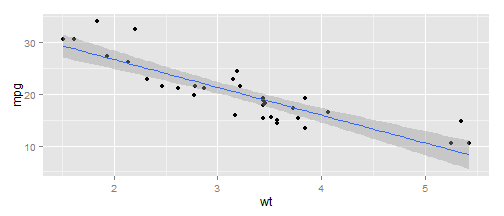

## Objective 

1.      Create an interactive shiny application that predicts MPG

2.      Prepare a prediction model

3.      Publish the shinyapps website

--- .class #id bg:white

## Approach 

*  The prediction model uses R dataset **mtcars**

*  Linear regression is used as method
$Y = a_0 + a_1*X_1 + a_2*X_2 + ...+ a_n*X_n$

*  The features "weight", "cylinder type", "gross horsepower", "transmission type" are chosen for exploration

*  The sum of Squared Error(SSE) is used
SSE = $\sum(Y_f-Y_a)^2$ where $Y_f$ is fitted and $Y_a$ is actual

--- .class #id bg:white

## Some exploratory results 

 

*       SSEs for linear models

[1] "formula = mpg ~ wt: 278.32"

[1] "formula = mpg ~ wt+hp: 195.05"

[1] "formula = mpg ~ wt+am: 278.32"

[1] "formula = mpg ~ wt+hp+cyl: 176.62"

--- .class #id bg:white

## The shiny app and the Code

*       The link of the shiny app is

[http://sdd1112.shinyapps.io/shiny](http://sdd1112.shinyapps.io/shiny) 

*       The github link for the code is

[https://github.com/sdd1012/shiny](https://github.com/sdd1012/shiny) 

